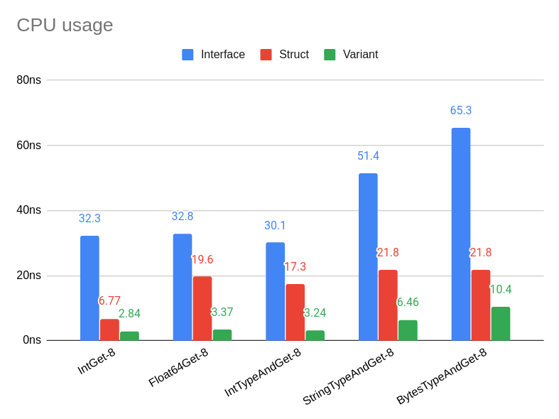

<p align="center">
  <a href="https://goreportcard.com/report/github.com/tigrannajaryan/govariant">
    
  </a>
  <a href="https://circleci.com/gh/tigrannajaryan/govariant">
    
  </a>
</p>

# Variant data type for Go.

**WARNING: this is an experimental package and is not intended for
production use.**

Variant (also known as [tagged union](https://en.wikipedia.org/wiki/Tagged_union)) allows to store values of one of the following types:

- int,
- float64,
- string,
- []byte slice,
- ordered list of Variant,
- ordered key/value list of Variant, where key is a string.
- empty or no value.

Variant implementation is optimized for performance: for minimal CPU and
memory usage. The implementation currently targets amd64 or 386 GOARCH 
only (it can be extended to other architectures).

This repository includes benchmarks that compare this implementation
of Variant with several other functionally equivalent implementations.

## Benchmarks

To run the benchmarks do `make benchmark`.

Below is a chart that shows CPU times of a few operations for
this and several alternate variant implementations (lower is better):

- [Interface](internal/interfacev/interfacev.go) - typical
  interface-based implementation of a variant
  data type (implementations like this are common in Go).
  
- [Struct](internal/plainstruct/plainstruct.go) - a struct
  that has a field for each possible value type plus
  a tag to store the type of the value.

- [Variant](variant/variant.go) - this implementation.



To see what each specific benchmark does prepend the label in the
x axis with "BenchmarkVariant" and find the corresponding function
in the source code (e.g. `BenchmarkVariantIntGet`).

The chart above shows benchmarking results for amd64 version,
compiled using go 1.15, running on Ubuntu 18 system with
Intel i7 7500U processor.

## Usage

To use a Variant first create and store a value in it, 
check the stored value type and read the value. For example:

```go
import "github.com/tigrannajaryan/govariant/variant"

v := variant.NewInt(123)
if v.Type() == VTypeInt {
	x := v.IntVal() // x is now int value 123.
}

```

Below is a more complete example that shows how to create a Variant,
check the type, fetch the data, iterate over list types, etc. 

```go
import (
	"fmt"
	"strings"

	"github.com/tigrannajaryan/govariant/variant"
)

// variantToString converts a Variant to a human readable string.
func variantToString(v variant.Variant) string {
	switch v.Type() {
	case variant.VTypeEmpty:
		return ""

	case variant.VTypeInt:
		return fmt.Sprintf("%v", v.IntVal())

	case variant.VTypeFloat64:
		return fmt.Sprintf("%v", v.Float64Val())

	case variant.VTypeString:
		return fmt.Sprintf("%q", v.StringVal())

	case variant.VTypeBytes:
		return fmt.Sprintf("0x%X", v.Bytes())

	case variant.VTypeValueList:
		sb := strings.Builder{}
		sb.WriteString("[")
		for i, e := range v.ValueList() {
			if i > 0 {
				sb.WriteString(", ")
			}
			sb.WriteString(variantToString(e))
		}
		sb.WriteString("]")
		return sb.String()

	case variant.VTypeKeyValueList:
		sb := strings.Builder{}
		sb.WriteString("{")
		for i, kv := range v.KeyValueList() {
			if i > 0 {
				sb.WriteString(", ")
			}
			sb.WriteString(fmt.Sprintf("%q: ", kv.Key))
			sb.WriteString(variantToString(kv.Value))
		}
		sb.WriteString("}")
		return sb.String()
	}
	panic("Unknown variant type")
}

func printVariant(v variant.Variant) {
	fmt.Printf("%s\n", variantToString(v))
}

func ExamplePrintVariant() {
	v := variant.NewInt(123)
	printVariant(v)

	v = variant.NewFloat64(1.23)
	printVariant(v)

	v = variant.NewString("Hello, World!")
	printVariant(v)

	v = variant.NewBytes([]byte{0xAF, 0xCD, 0x34})
	printVariant(v)

	v = variant.NewValueList(
		[]variant.Variant{
			variant.NewInt(10),
			variant.NewString("abc"),
		},
	)
	printVariant(v)

	v = variant.NewKeyValueList(
		[]variant.KeyValue{
			{Key: "intval", Value: variant.NewInt(10)},
			{Key: "a string", Value: variant.NewString("abc")},
			{Key: "list", Value: v},
		},
	)
	printVariant(v)

	// Output: 123
	// 1.23
	// "Hello, World!"
	// 0xAFCD34
	// [10, "abc"]
	// {"intval": 10, "a string": "abc", "list": [10, "abc"]}
}
```